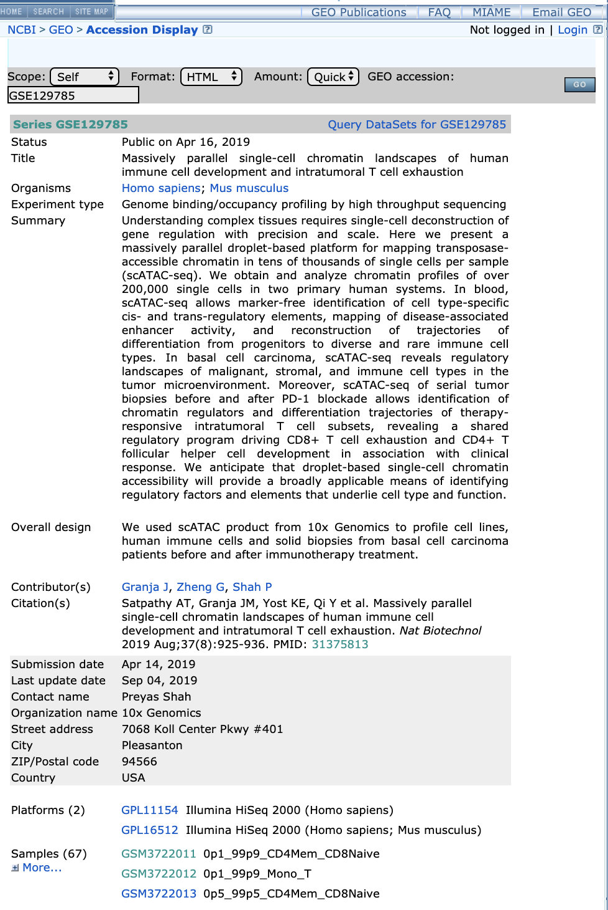
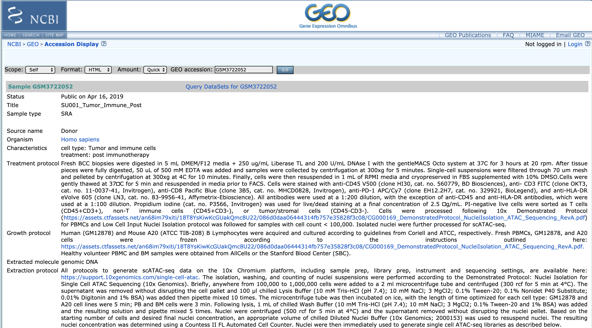
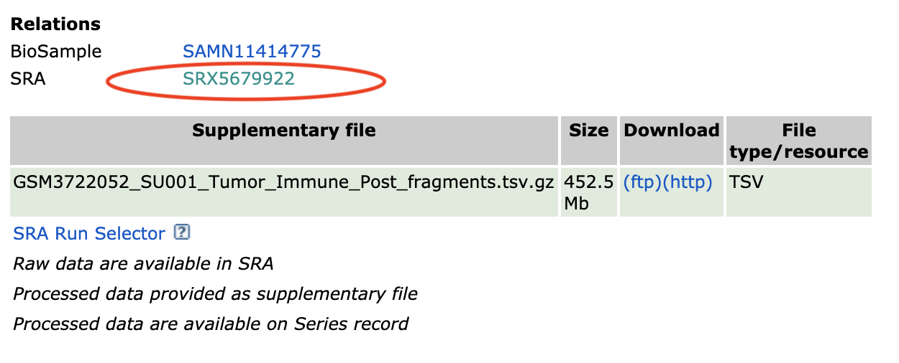
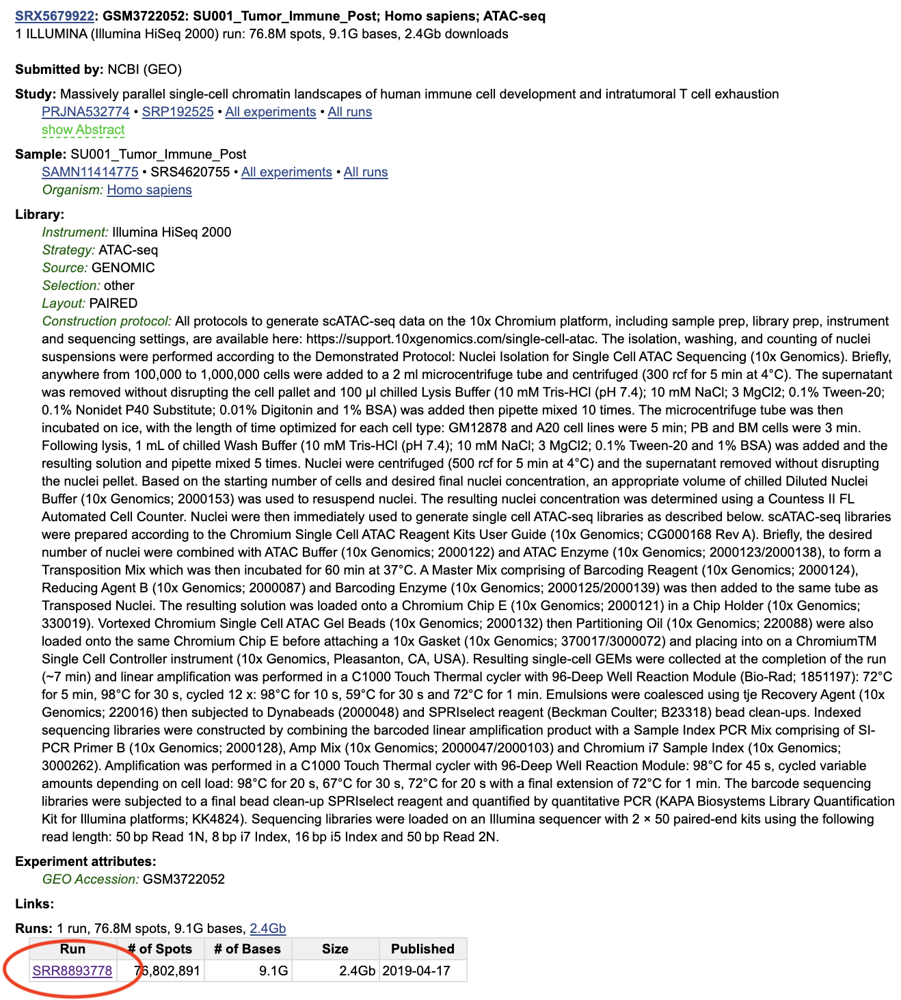
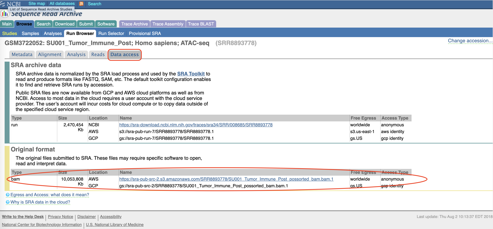

# Massively parallel single-cell chromatin landscapes of human immune cell development and intratumoral T cell exhaustion. Nature Biotechnology (Satpathy*, Granja* et al. 2019)

## **Link** : https://www.nature.com/articles/s41587-019-0206-z

## Please cite : Satpathy*, Granja* et al. , Massively parallel single-cell chromatin landscapes of human immune cell development and intratumoral T cell exhaustion. Nature Biotechnology (2019)  

# Downsampled test data for PBMCs is available (~500 MB)

https://jeffgranja.s3.amazonaws.com/10x-scATAC-share/10x-scATAC-Downsampled-PBMC-hg19-data.zip

# Links To Supplementary Data

## Notes

**.rds** file is an R binarized object to read into R use readRDS(filename)

**SummarizedExperiment** is a class in R see :  https://bioconductor.org/packages/release/bioc/html/SummarizedExperiment.html

**deviations** (TF chromVAR) is a class in R see :  https://bioconductor.org/packages/release/bioc/html/chromVAR.html

## scATAC-seq Hematopoiesis

## scATAC-seq BCC Tumor Microenvironment

## scATAC-seq BCC Tcells (Exhaustion)

# Getting 10x scATAC-seq Bam Files

## 1. Go to NIH GEO Page : https://www.ncbi.nlm.nih.gov/geo/query/acc.cgi?acc=GSE129785&holding=F1000&otool=stanford.

## 2. Click on a sample (I am showing SU001_Tumor_Immune_Post).

## 3. Navigate down to the bottom and click on SRA link.

## 4. Navigate down and fine the run SRR.

## 5. Click on "Data Access" Tab and then navigate to "Original Format"

